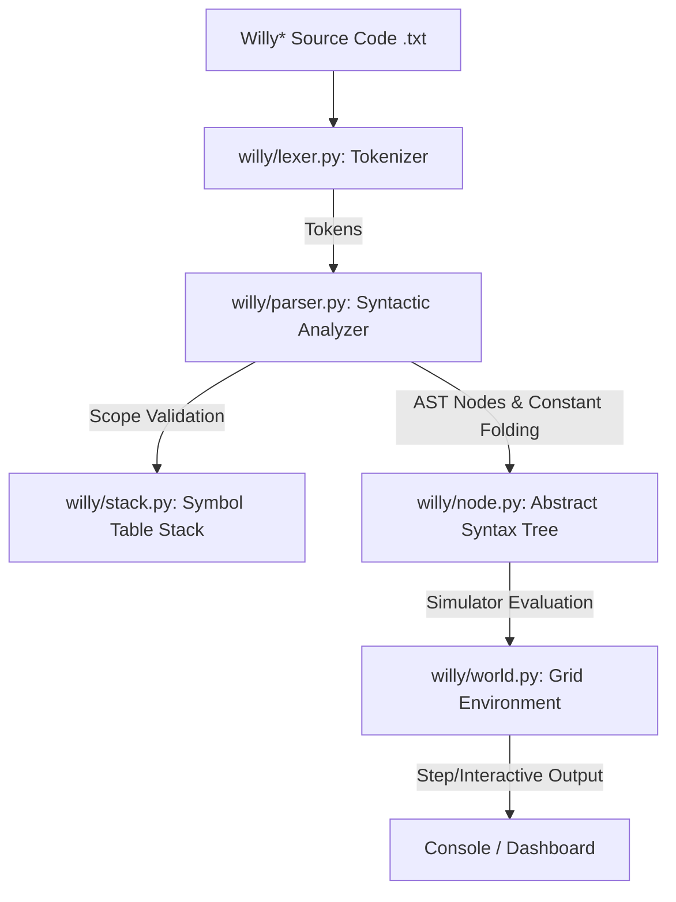

# Willy* Interpreter & Simulator

A high-performance Python-based interpreter, Abstract Syntax Tree (AST) optimizer, and interactive simulator for the **Willy\*** robot programming language.

## Table of Contents
- [About Willy\*](#about-willy)
- [How the Project Works](#how-the-project-works)
- [Writing and Using Willy\* Programs](#writing-and-using-willy-programs)
- [Architecture \& Design](#architecture--design)
- [Key Features \& Optimizations](#key-features--optimizations)
- [Installation](#installation)
- [Usage Guidelines](#usage-guidelines)
- [Interactive Dashboard](#interactive-dashboard)
- [Optimization Benchmarks](#optimization-benchmarks)
- [Verification \& Test Suite](#verification--test-suite)
- [Language Specification](#language-specification)
- [Contributors \& Citation](#contributors--citation)

---

## About Willy*

**Willy\*** is a domain-specific programming language designed for controlling an autonomous robot named **Willy** navigating a finite, two-dimensional grid. Willy interacts with objects of various types and colors, moves around walls, monitors sensor states, manages carrying capacities in his basket, and executes tasks to achieve specific logical goals.

This repository implements a complete interpreter, lexical analyzer, syntactic parser, symbol validator, static semantics analyzer, performance-optimized simulator, and visualizer.

*This project was originally created as a course project for **Compilers / Translators (CI3725)** at **Simón Bolívar University (USB)**, during the January-March 2020 academic term.*

---

## How the Project Works

The Willy* interpreter processes and simulates program execution through three distinct architectural phases:



1. **Lexical Analysis ([lexer.py](file:///Users/jmarcano/workspaces/Willy/willy/lexer.py))**:
   Converts raw text streams into token sequences (such as block boundary markers, movement commands, identifiers, and numbers).
2. **Syntactic and Semantic Analysis ([parser.py](file:///Users/jmarcano/workspaces/Willy/willy/parser.py))**:
   Uses PLY Yacc to parse grammar structures. During syntactic reduction, it verifies variable declarations and scope hierarchies using a dictionary-backed scope stack ([stack.py](file:///Users/jmarcano/workspaces/Willy/willy/stack.py)). It also optimizes negation branches (Double Negation Elimination) and outputs a validated Abstract Syntax Tree (AST).
3. **Execution Simulation ([world.py](file:///Users/jmarcano/workspaces/Willy/willy/world.py) & [node.py](file:///Users/jmarcano/workspaces/Willy/willy/node.py))**:
   Instantiates the 2D grid environment representing coordinate states, obstacles, object placements, and Willy's state. The AST root initiates evaluation on the nodes recursively. The simulator monitors subgoal criteria and stops when the final goal evaluation yields `True` or a `terminate` command executes.

---

## Writing and Using Willy* Programs

Every Willy* program is structured into a **World Definition** block followed by a **Task Definition** block.

### Language Rules & Syntax
For complete grammar structures, allowed operations, and sensory checks, refer to the [Willy* Language Specification and Rules](file:///Users/jmarcano/workspaces/Willy/willy_rules.md).

### Example Program Code (`example.txt`)
```willy
begin-world space_grid
    # Define a 5 column x 5 row grid
    World 5 5

    # Define a wall on the north side of cell (2, 2)
    Wall north from 2 2 to 2 2

    # Define objects and place them
    Object-type star of color yellow
    Place 1 of star at 3 3
    
    # Configure Willy starting parameters
    Start at 1 1 heading east
    Basket of capacity 2

    # Define subgoals
    Goal reached_target is willy is at 4 4
    Goal picked_star is 1 star objects in basket

    # The program succeeds if Willy gets the star AND reaches (4, 4)
    Final goal is reached_target and picked_star
end-world

begin-task clean_run on space_grid
    # Define a macro instruction to move twice
    define move_twice as
    begin
        move;
        move;
    end

    # Program starts here:
    move_twice;    # Willy is now at (3, 1)
    turn-left;     # Turn left (facing north)
    move_twice;    # Willy is now at (3, 3)

    # Pick up the star object
    if found(star) then
        pick star;

    turn-right;    # Turn right (facing east)
    move;          # Willy is now at (4, 3)
    turn-left;     # Turn left (facing north)
    move;          # Willy is now at (4, 4)
end-task
```

---

## Architecture & Design

The project follows clean architectural principles, modularizing lexicographical analysis, syntactic reduction, AST node evaluation, and terminal visualization.

### Directory Layout
```text
Willy/
├── Makefile                # Build, test, and benchmark orchestration
├── README.md               # Repository documentation (this file)
├── willy_rules.md          # Complete language specification rules
├── benchmark.py            # Micro-benchmarking suite for LCA solver
├── test_runner.py          # Automated test execution harness
├── tests/                  # Integration test suites (.txt)
│   ├── TicTacToe.txt
│   ├── PickStars.txt
│   └── ...
└── willy/                  # Core package directory
    ├── __init__.py         # Package initialization
    ├── cli.py              # Command-line entry point and wrapper interface
    ├── lexer.py            # Lexical analyzer using PLY Lex
    ├── parser.py           # Syntactic reduction & semantic analysis using PLY Yacc
    ├── stack.py            # Scope-aware stack for symbol table management
    ├── world.py            # Environment model (grid, walls, and cell coordinates)
    ├── task.py             # Execution runtime manager
    ├── node.py             # AST Node structures and recursive evaluation logic
    ├── model_procedure.py  # User-defined macro procedures
    ├── lca.py              # AST Lowest Common Ancestor (LCA) path solver
    └── dashboard.py        # Terminal visualizer and AST layout renderer
```

---

## Key Features & Optimizations

This modernized version of the Willy* interpreter introduces several compiler optimizations and structural enhancements:

### 1. Robust Lexical Scoping
Variable and custom procedure scopes are strictly isolated. We replaced unstructured global parser state transitions with a stack-based symbol table manager ([stack.py](file:///Users/jmarcano/workspaces/Willy/willy/stack.py)). 
- **World Boundary**: Scopes are pushed on `begin-world` and popped on `end-world`.
- **Task Boundary**: Scopes are pushed on `begin-task` and popped on `end-task`.
- **Procedure Definitions**: Custom macro instructions (`define <id> as <inst>`) push an isolated scope, avoiding declaration pollution.
- Lookups operate in $O(1)$ amortized time by querying dictionary hierarchies.

### 2. Lowest Common Ancestor (LCA) Caching Solver
To enable advanced AST analysis, static validation, and debugging, we implemented a Lowest Common Ancestor (LCA) query interface ([lca.py](file:///Users/jmarcano/workspaces/Willy/willy/lca.py)):
- **DFS Path Indexing**: Pre-calculates root-to-node paths for all nodes during compiler reduction.
- **$O(1)$ Query Caching**: Computes the LCA of two AST nodes based on paths. Divergences are cached to ensure constant-time queries.
- **Explainable Divergence**: Provides detailed explanations of structural path deviations (e.g. conditional branches, loops, sequential statements).

### 3. AST Constant Folding
Static expressions are pre-evaluated during compilation to reduce runtime interpretation overhead:
- **Double Negation Elimination**: Expressions like `not not <test>` are automatically simplified to `<test>` directly in the AST.
- Pre-evaluated constant expressions lower depth and execution complexity.

### 4. Efficient Grid Coordinate Mapping
Grid spatial queries (such as wall collision checks or object lookups) have been optimized to $O(1)$ query complexity using coordinate dictionaries, avoiding linear list iterations.

---

## Installation

### Prerequisites
- **Python**: 3.8 or higher.
- **PLY (Python Lex-Yacc)**: Install via pip:
  ```bash
  pip install ply
  ```

### Build & Package Setup
Use the provided `Makefile` to install a globally accessible CLI wrapper:

```bash
# Link the 'willy' executable wrapper to ~/.local/bin/willy
make install
```

Make sure your shell PATH includes `~/.local/bin`.

---

## Usage Guidelines

Run the simulator using the standard `willy` command. It supports three main execution modes:

### 1. Manual Execution Mode
Execute the simulation step-by-step. The system prints the updated grid state and waits for you to press `Enter` to step forward:
```bash
willy tests/WillyCleanItsRoom.txt -m
```

### 2. Automatic Execution Mode
Execute the simulation automatically with a customizable delay (in seconds) between simulation steps:
```bash
# Run with a 0.5-second delay per step
willy tests/WillyCleanItsRoom.txt -a 0.5

# Run instantly (0-second delay)
willy tests/WillyCleanItsRoom.txt -a 0
```

### 3. Interactive Dashboard Mode
Launches the interactive visualization dashboard in your terminal:
```bash
willy tests/WillyCleanItsRoom.txt -i
```

---

## Interactive Dashboard

Selecting **Interactive Dashboard Mode (`-i`)** launches an analytical terminal panel offering:
1. **Display AST Layout**: Recursively renders a beautiful ANSI-colored tree diagram of the compiled program.
2. **Retrieve AST Metrics**: Displays node counts, tree depth, and token details.
3. **Query LCA (Lowest Common Ancestor)**: Input two AST node indices to locate their lowest common ancestor along with a detailed explanation of their structural divergence point.
4. **Execute Simulation**: Initiates the robot simulator run.

---

## Optimization Benchmarks

We benchmarked the Lowest Common Ancestor (LCA) path-caching solver against standard recursive tree traversal across balanced binary trees of depths 6 through 12, running 2,000 queries per depth level:

| Tree Depth | Number of Nodes | Queries | Recursive Traversal (s) | Cached Path LCA (s) | Speedup |
|:---:|:---:|:---:|:---:|:---:|:---:|
| **6** | 127 | 2000 | 0.0336 s | 0.0028 s | **11.88x** |
| **7** | 255 | 2000 | 0.0922 s | 0.0022 s | **41.83x** |
| **8** | 511 | 2000 | 0.1432 s | 0.0026 s | **55.23x** |
| **9** | 1023 | 2000 | 0.3134 s | 0.0033 s | **94.12x** |
| **10** | 2047 | 2000 | 0.6507 s | 0.0032 s | **206.28x** |
| **11** | 4095 | 2000 | 1.1993 s | 0.0033 s | **363.29x** |
| **12** | 8191 | 2000 | 2.4150 s | 0.0061 s | **396.77x** |

> [!TIP]
> **Performance Scaling Analysis**: While recursive tree traversal time grows exponentially with node count ($O(N)$ depth searches), the cached path LCA solver processes queries in constant time ($O(1)$ amortized lookup), reaching up to a **~400x speedup** on larger syntax trees.

To run benchmarks on your local system:
```bash
make benchmark
```

---

## Verification & Test Suite

An automated test suite checks compile-time parsing, semantic validation, and runtime simulation goals across 17 test suites:

```bash
make test
```

### Included Test Cases (`tests/` directory)
- [PickStars.txt](file:///Users/jmarcano/workspaces/Willy/tests/PickStars.txt): Willy collects exactly 3 star objects in a 8x9 sky world to achieve his final goal.
- [WillyCleanItsRoom.txt](file:///Users/jmarcano/workspaces/Willy/tests/WillyCleanItsRoom.txt): Willy picks up clothing and books, places them at the correct desks, and drops trash in the laundry basket.
- [EatClean.txt](file:///Users/jmarcano/workspaces/Willy/tests/EatClean.txt): Willy navigates a grid full of healthy (apples, cherries) and unhealthy (pizza) food, consuming only the former.
- [WriteFirstLetterOfMyName.txt](file:///Users/jmarcano/workspaces/Willy/tests/WriteFirstLetterOfMyName.txt): Willy draws/writes the letter "W" using grid coordinates.
- [ComesHappyToUni.txt](file:///Users/jmarcano/workspaces/Willy/tests/ComesHappyToUni.txt): State variable tracking simulation where events (traffic lights vs listening to music) alter Willy's mood.
- [WillyScan.txt](file:///Users/jmarcano/workspaces/Willy/tests/WillyScan.txt): Navigation on a 20x20 grid avoiding obstacles and keeping track of limited lifespans/hearts.
- [EsferasDelDragon.txt](file:///Users/jmarcano/workspaces/Willy/tests/EsferasDelDragon.txt): Dynamic pathfinder labyrinth solving to retrieve a dragon sphere.
- [Laberinto.txt](file:///Users/jmarcano/workspaces/Willy/tests/Laberinto.txt): Labyrinth maze navigation test utilizing wall sensors.
- [TicTacToe.txt](file:///Users/jmarcano/workspaces/Willy/tests/TicTacToe.txt): Simulation of a turn-based Tic-Tac-Toe layout.
- Other semantic test files verify basic logic: `binary.txt`, `casoEasy.txt`, `casopruebaq.txt`, `mentiravale.txt`, `otherprobe.txt`, `pruebas.txt`, `simple.txt`, `worldsito.txt`.

---

## Language Specification

The complete structural syntax rules, world creation options, movement instructions, and sensor queries are documented in the specification file:

👉 **[Willy* Language Specification and Rules](file:///Users/jmarcano/workspaces/Willy/willy_rules.md)**

---

## Contributors & Citation

This interpreter environment is based on the original 2020 Simón Bolívar University coursework and has been modernized with custom optimizations:

- **Original Authors & Designers**:
  - Jesús Marcano ([@jcellomarcano](https://github.com/jcellomarcano))
  - María Magallanes ([@mafermazu](https://github.com/MaferMazu))
- **Refactoring & Modernization**:
  - Antigravity (AI pair-programming assistant)

---
*Developed under MIT License guidelines. SIMÓN BOLÍVAR UNIVERSITY, Department of Computer Science.*
